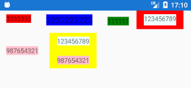

# Flex Layout for Xamarin Forms
 

## About
This project is maintained by Naxam Co.,Ltd.<br>
We specialize in developing mobile applications using Xamarin and native technology stack.<br>

**Looking for developers for your project?**<br>

<a href="mailto:tuyen@naxam.net"> 
</a> <br>

# Depedendencies

- Xamarin Forms

## How to use

### Install NUGET package
```
Install-Package Naxam.Layouts.FlexLayout
```

### Add XML namespace in your XAML
```xml
xmlns:layout="clr-namespace:Naxam.Layouts;assembly=Naxam.Layouts"
```

###
```xml
<?xml version="1.0" encoding="utf-8" ?>
<ContentPage
    xmlns="http://xamarin.com/schemas/2014/forms"
    xmlns:x="http://schemas.microsoft.com/winfx/2009/xaml"
    xmlns:local="clr-namespace:LayoutQs"
    xmlns:layout="clr-namespace:Naxam.Layouts;assembly=Naxam.Layouts"
    x:Class="LayoutQs.MainPage">
    <layout:FlexLayout>
        <Label
            Text="3333333"
            VerticalOptions="Start"
            Margin="16,8"
            BackgroundColor="Red" />
        <Label
            VerticalOptions="Center"
            Margin="16,8"
            FontSize="Medium"
            BackgroundColor="Blue"
            Text="2222222222" />
        <Label
            Margin="16,8"
            VerticalOptions="End"
            BackgroundColor="Green"
            Text="111111" />

        <ContentView
            BackgroundColor="Red">
            <Label
                Margin="16,8"
                BackgroundColor="Azure"
                Text="123456789" />

        </ContentView>
        <Label
            Margin="16,8"
            BackgroundColor="Pink"
            VerticalOptions="Center"
            Text="987654321" />
        <StackLayout
            BackgroundColor="Yellow"
            Margin="8">
            <Label
                Margin="16,8"
                BackgroundColor="Azure"
                Text="123456789" />
            <Label
                Margin="16,8"
                BackgroundColor="Pink"
                Text="987654321" />
        </StackLayout>
    </layout:FlexLayout>
</ContentPage>

```

## Source Code
- Naxam.Layouts.FlexLayout.cs

## License
FlexLayout is released under the Apache License license.
See [LICENSE](./LICENSE) for details.